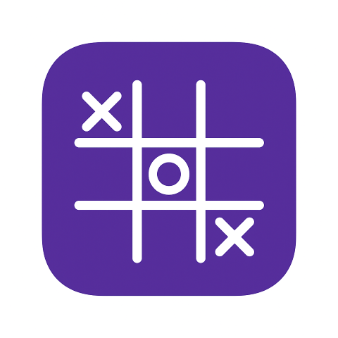
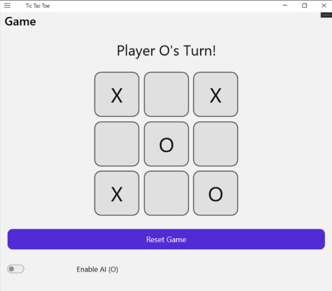
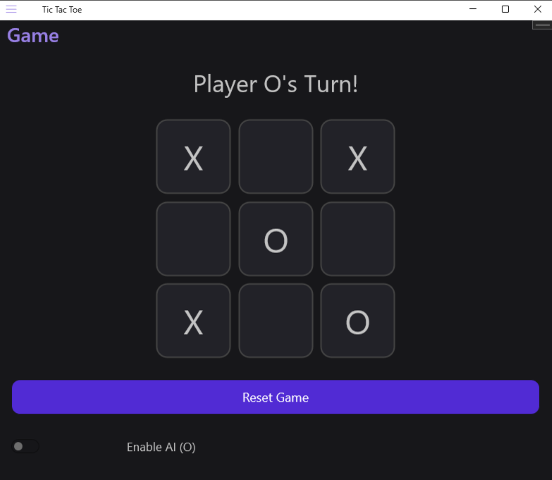
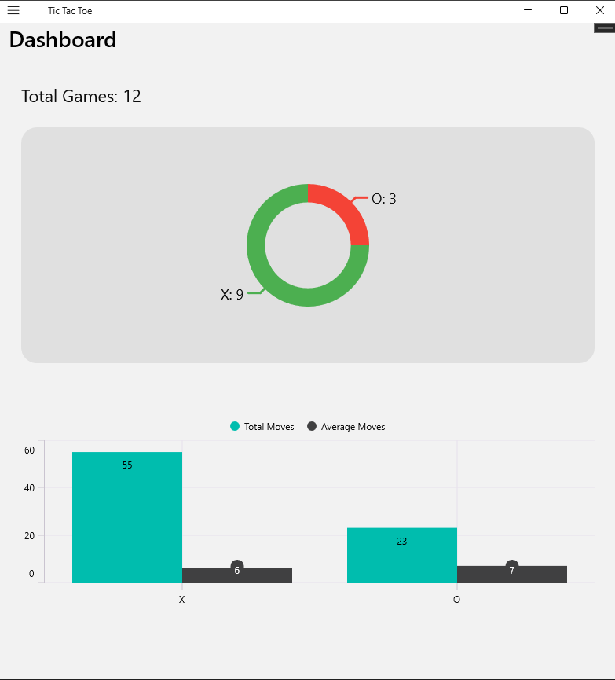
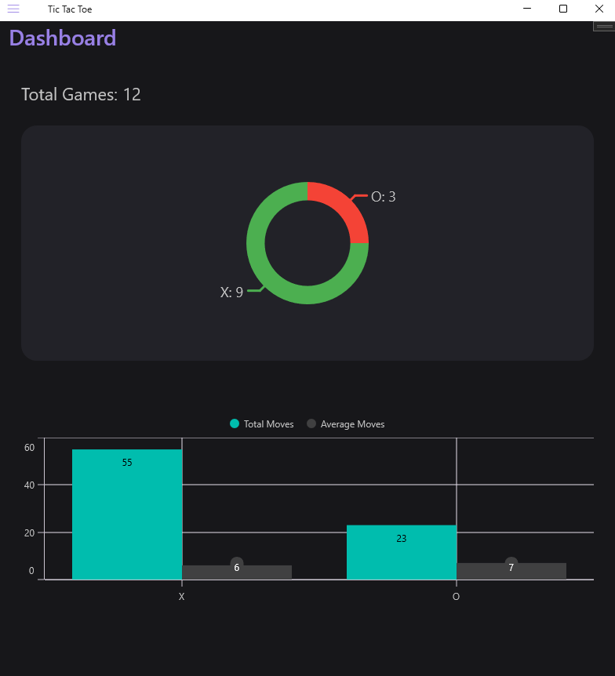

# 🎮 Advanced Tic-Tac-Toe — MAUI Edition

An enhanced **Tic-Tac-Toe** game built with **.NET MAUI**, featuring animated interactions, accessibility support, AI opponent mode, and a unique gameplay twist:

> When a player places a third symbol (X or O) *without creating a winning line*,  
> the **oldest placed symbol begins to "breathe"** to visually warn the player it will be removed on the next move.

This turns classic Tic-Tac-Toe into a more strategic and dynamic experience.

---

## 📸 Screenshots

### Gameplay

### Dashboard

## 🧠 How the Game Works

### 1️⃣ Traditional Tic-Tac-Toe Rules  
If a player forms a line of **three in a row**, that player immediately wins.

### 2️⃣ FIFO Rule (New Mechanic)
If placing the 3rd symbol does **not** result in a win:

- The **oldest placed symbol** starts to **breathe** (soft scale animation)
- On the *next move*, that oldest symbol is removed
- The board always contains **at most 3 symbols per player**

This keeps the board in constant motion and prevents stalemates.

---

## 🧩 Accessibility

The app is fully accessible:

- All cells have `SemanticProperties.Description`
- Animations do not cause flashing or flickering
- High-contrast theme supported
- Colors validated against WCAG contrast guidelines

---

## ❤️ Contributing

Contributions are welcome!  
If you have ideas or improvements, feel free to open an issue or create a pull request.

---

## 📄 License

MIT License © SkJonko